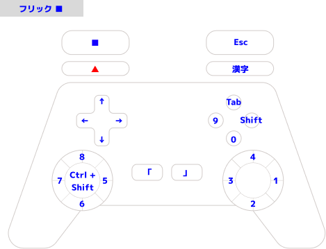
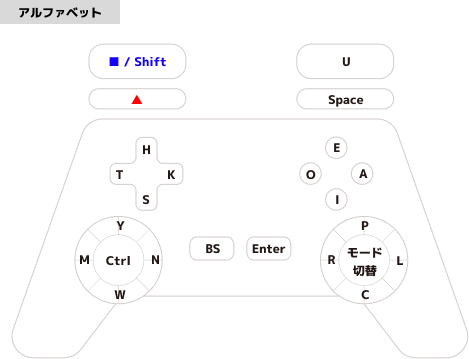
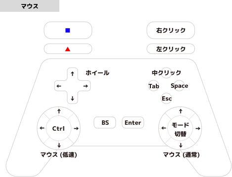
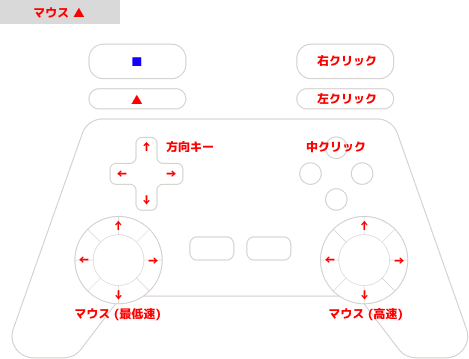

# gamepad-keyboard-layout

***WARNING: Work in Progress (Currently not all features implemented, and drafting phase)***

--

***注意: 作業中 (現段階では未実装部分が多くあり、草稿段階です)***

## About

Keyboard layout and mouse control using gamepad.

--

ゲームパッドだけを使って文字入力やカーソル入力ができるようにするためのもの。

## Usage - 使い方

```bash
$ pip install -r requirements.txt
$ python gamepad-input.py # -h shows help, -d shows debug info
```

## Concept - コンセプト

Letter input and cursor control using gamepad (like Switch JoyCon) would be nice for making arms free and eliminating stress, compared to conventional mice and keyboards.

--

作業をする際に、両腕が常に自由にいれるようにするために、マウスやキーボードでは不自由だと考えた。SwitchのJoyConなど、ゲームパッドを使って文字入力やカーソル操作ができれば、それらが解決されるという理想をもって取り組み始めた。

## Layout - レイアウト

***WARNING: Draft phase - 注意: 草案段階***

PDF: [gamepad_keyboard_layout.pdf](./doc/gamepad_keyboard_layout.pdf)

### Button names - ボタン名


### Basic Rules - 基本ルール

- L/ZL is shift key, both prefix shift and simultaneous shift

--

- L/ZLはシフトキーで、前置シフト兼通常シフト

### Flick Mode - フリックモード




### Romaji Mode - ローマ字モード


### Alphabet Mode - アルファベットモード




### Mouse Mode - マウスモード






## License

[LGPL-2.1](./LICENSE)
